# 1 基础网络学习

## 1.1 BatchNormalization

原文是说减少分布协变，后来研究发现是加入噪声。

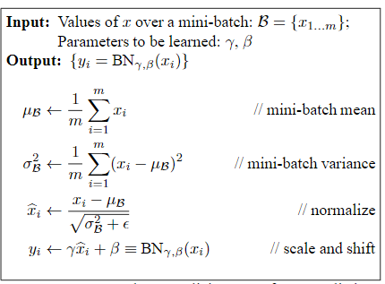

## 1.2 ResNet

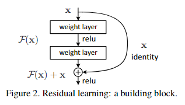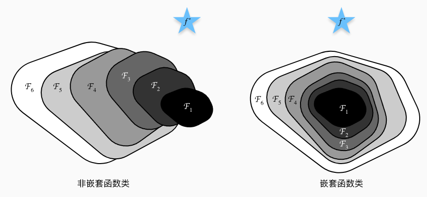

拟合0比拟合f(x)容易，使得函数空间的扩展更加有序。

## 1.3 RNN

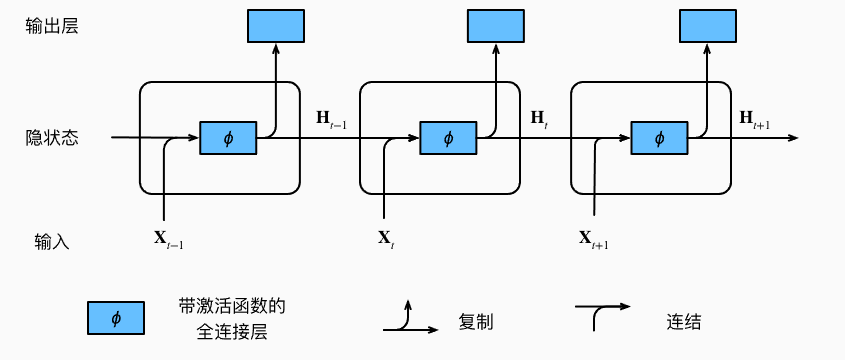

## 1.4 GRU

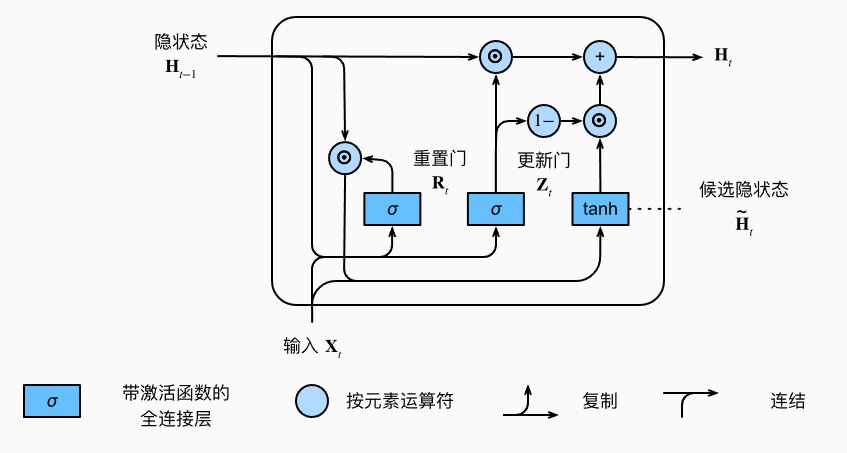

## 1.5 LSTM

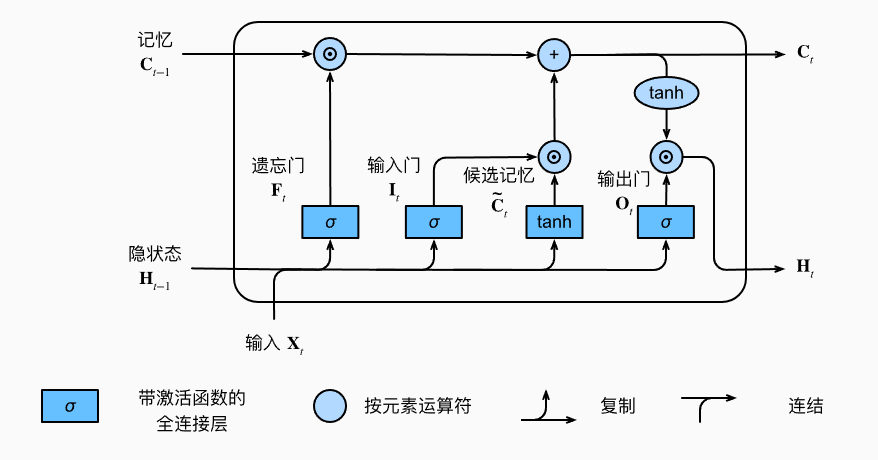

# 2 其他

## 2.1 BEVFusion

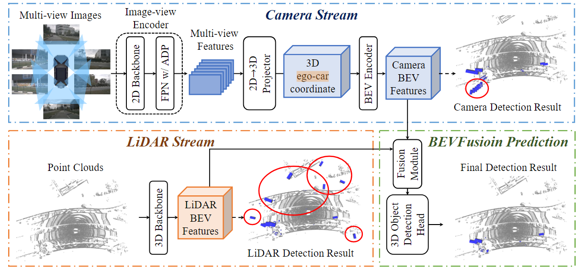

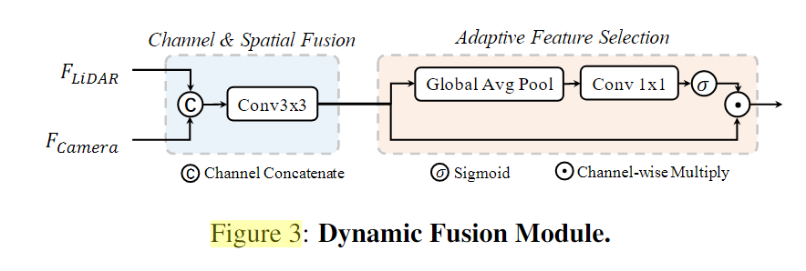

## 2.2 nuScenes

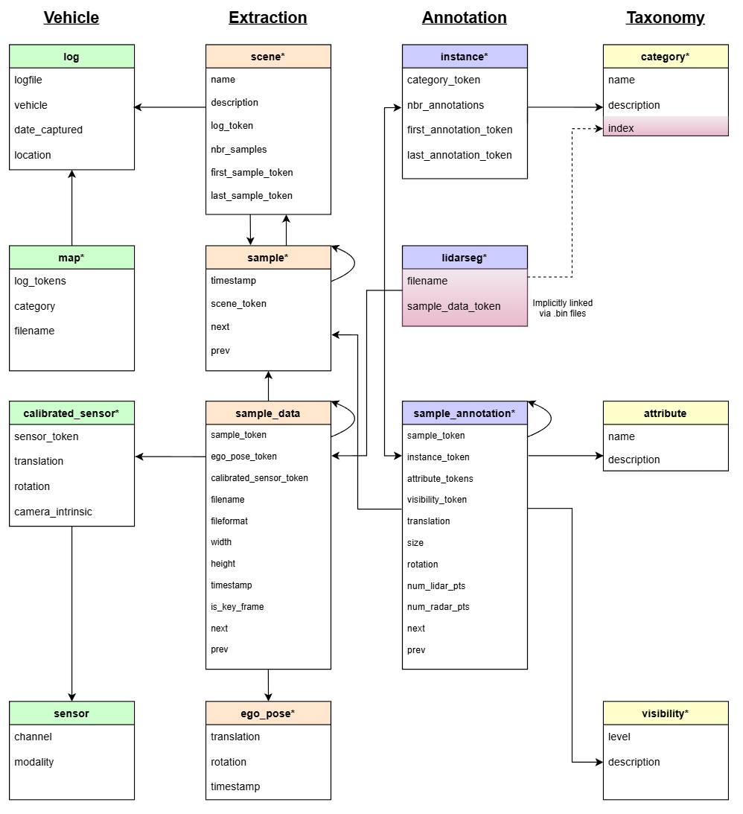

# 计划学习
## 3.1 MMCV MMDET MMDET3D

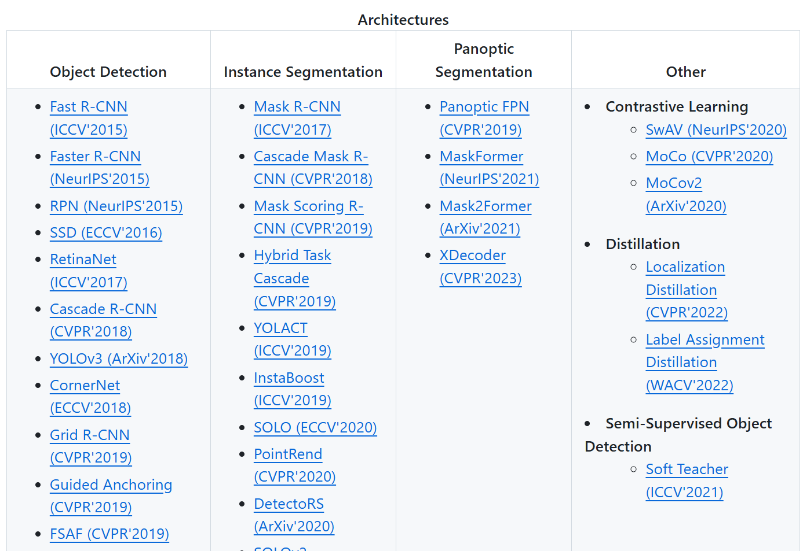

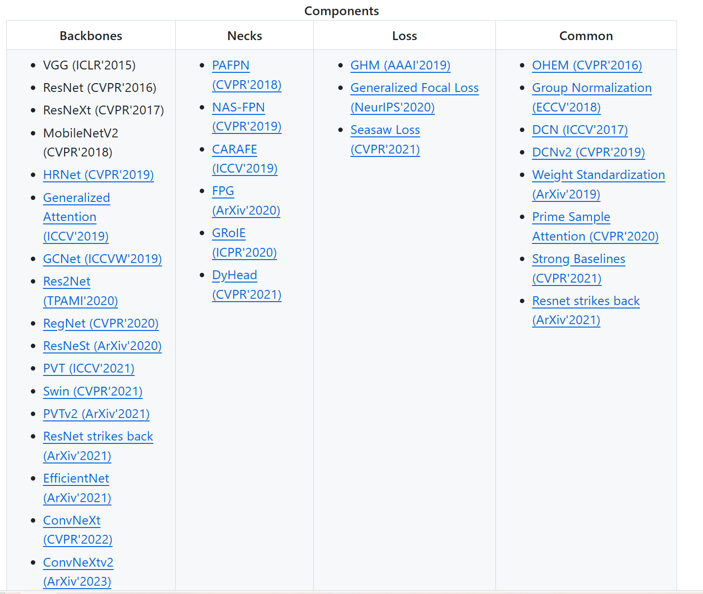

## 3.2 Transformer

计划学习
