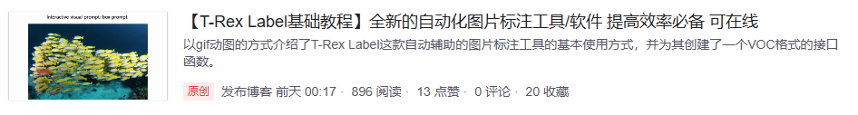

# Summary 20240929

## 01 R-CNN系列

对于图像检测，之前还是只会一个训练+应用，具体细节不甚了解，目前先了解了一下RCNN系列的基本思想(区域提取-特征提取-分类/回归)和构架，并整理如下：

## 02 T-Rex Label 图像标注软件

标注效果如下，相比于传统的图像标注方式，极大地提高了效率。

起源是带我写论文的一个老师给同一个小组的同学布置了份标注的任务，而一张图有太多目标，传统的标注方式太慢了，因而想起了T-Rex Label标注。可惜，官方给的在线标注只能够导出YOLO和COCO的标注格式，因此自己写了个YOLO2VOC的小接口，并撰写了下述CSDN博客给小组成员作参考：

## 2024第二届国防科技高地论坛

9月27日下午我参加了第二届国防科技高地论坛，在会上，来自国地共建人形机器人创新研究中心的江磊、来自上海交通大学的闫维新、来自清华大学的孙富春作了关于人形机器人/三位一体作战模式/具身智能的报告。有些许感触记录如下：

| 序号                    | 内容                                                         | 备注                                                         |
| ----------------------- | ------------------------------------------------------------ | ------------------------------------------------------------ |
| ${\color{#86C166}{01}}$ | 政策：工信部《人形机器人创新发展指导意见》                   | 这个在写项目申报或背景介绍时可以用到                         |
| ${\color{#86C166}{02}}$ | 2022年 人形机器人死与生的一年，阿西莫夫之死vs.特斯拉之生     | 介绍项目背景时可用到                                         |
| ${\color{#86C166}{03}}$ | 人形机器人技术在中国的发展偏向于落地应用，而在美国倾向于从0-1的技术突破。这可以说是差异而非差距。 | 介绍项目背景时可用到                                         |
| ${\color{#E16B8C}{04}}$ | 人形机器人技术四板块：平台技术、具身智能、数据集、训练场     | 目前我国企业大量涌入发展平台技术，其他三个的国内企业为0      |
| ${\color{#E16B8C}{05}}$ | 人形机器人三难：机构难、控制难、数据难                       | ①机构难：强对标人体，设计肢体结构，并使得每个机构都智能化，特别对于灵巧手，触觉传感器很重要；②控制难：利用高维的行为范式（大模型）去控制，而非传统的现代控制理论；③数据难：做到动捕与仿真虚实结合，合力构建大规模的数据集和训练场地 |
| ${\color{#E16B8C}{06}}$ | 人形机器人关节多为旋转式，可以尝试去使用直线式与旋转式相结合，并且对于特定的关节电机而言，可采样新型的轴向磁通技术 | 突破了对人形机器人形态的刻板印象                             |
| ${\color{#E16B8C}{07}}$ | 可以使用一种时空双变速比的关节设计和控制方案，实现关节的高负载 | 结合时序信息，改变变速比，提高负载能力                       |
| ${\color{#E16B8C}{08}}$ | www.openloong.org.cn                                         | 开源青龙人形机器人网站，含硬件、具身智能操作系统、全身动力学控制和数据集 |
| ${\color{#F75C2F}{09}}$ | 无人机和无人狗在作战中可以使用自爆模式                       | 应用自爆的方式，扩宽无人平台的战场应用                       |
| ${\color{#F75C2F}{10}}$ | 不同的人形机器人要有不同的工种                               | 细致化战时的人形机器人设计与应用相适性                       |
| ${\color{#F75C2F}{11}}$ | 战场时机器人续航问题                                         | 可以把每个动态的机器人和静态的充电桩比作一个个的节点，各节点间可以相互充电，利用通信，全局地实现续航调度与战斗效益的结合 |
| ${\color{#2EA9DF}{12}}$ | 具身智能的核心是要求有在发生未知意外时，自处理的能力         | 这个的确重要，但这种能力会不会影响常时工作的可靠性以及这种发展出来的自处理能力有没有可能超过约束的范围，从而伤害到人类。 |
| ${\color{#2EA9DF}{13}}$ | 具身智能的关键是要有动作解析的能力（利用图网络，拓普网络等） | 化繁为简，把负载的任务分解一个个基础的小任务，且这些任务的组合可以实现最大程度的还原 |
| ${\color{#2EA9DF}{14}}$ | 具身自能奖惩函数的构建                                       | 这个要考察许多方面，比如完成度、场景、完成时间等等等等，甚至根据状态自动生成奖惩函数 |
| ${\color{#2EA9DF}{15}}$ | 研究如何使机器产生人类的直觉                                 | 猜想可能与状态阈值激活、特征匹配有关、快速通道有关 （有点像DMA） |
| ${\color{#2EA9DF}{16}}$ | 首次展示了具身智能训练的灵巧手如何做到穿针引线               | 很厉害，感觉到了具身智能的巨大潜力                           |
| ${\color{#7A2E5B}{17}}$ | 论文：Deep Multimodal Fusion by Chaanel Exchanging (孙富春)  | 介绍了一种通过交换通道实现多传感器融合时自适应调整各个传感器数据有效性倾向的方案：CEN多模态融合框架 |
| ${\color{#7A2E5B}{18}}$ | 3D感知在人形机器人尤其是具身智能中显示出越来越重要的作用     | 3D融合感知在许多方向都显示出其重要性，感知该往这个方向发展   |

