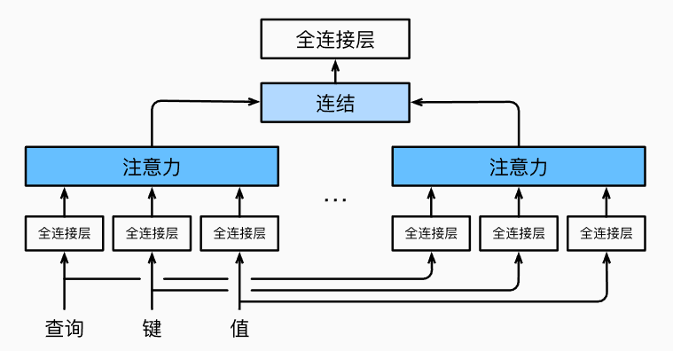
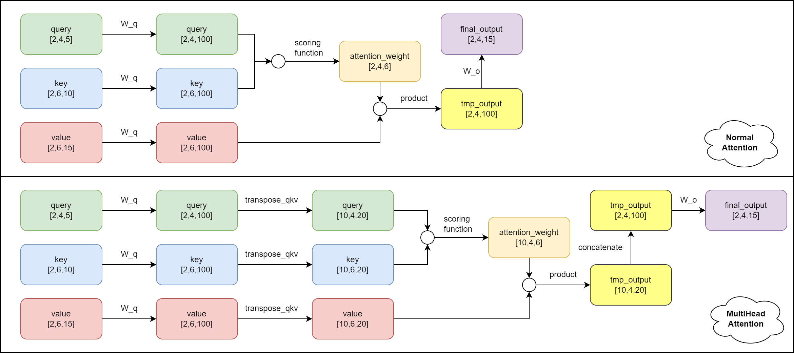
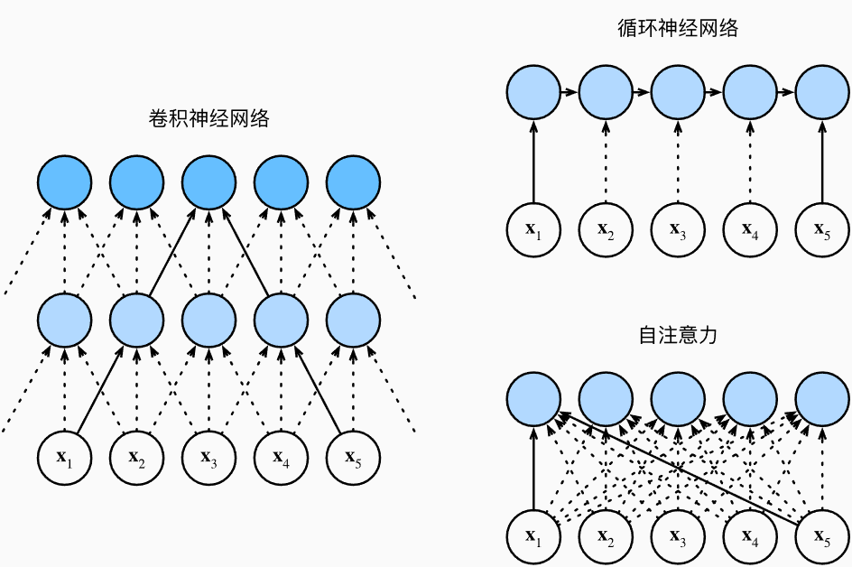
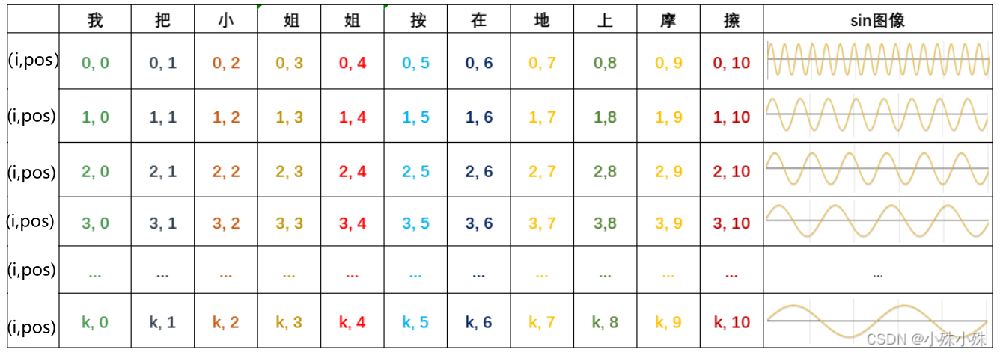
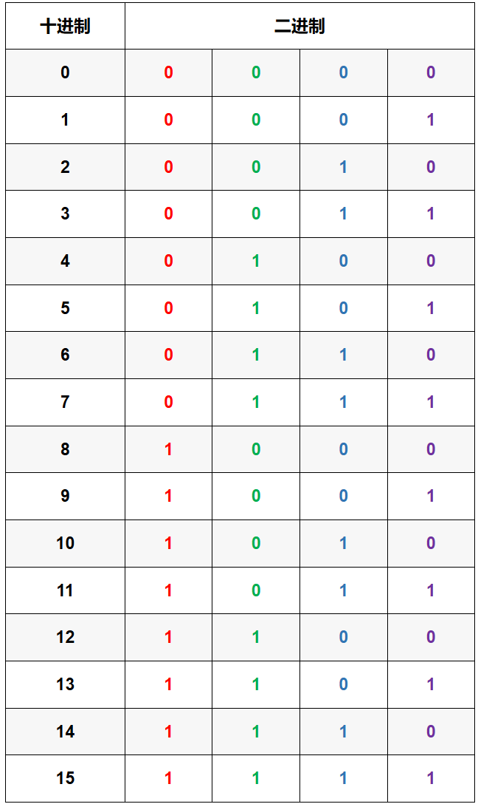
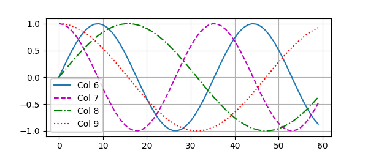
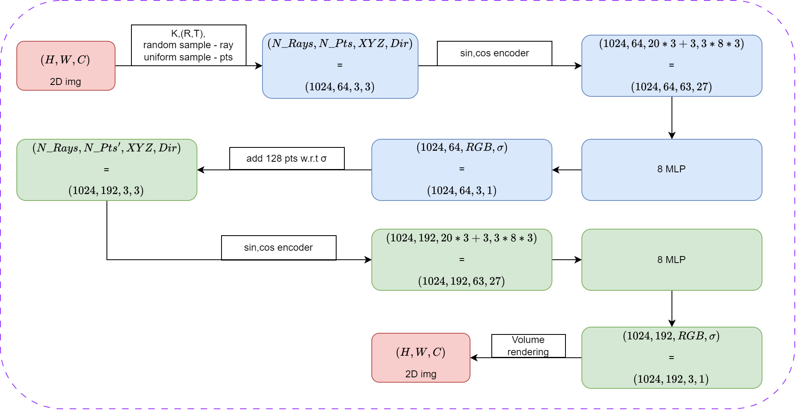
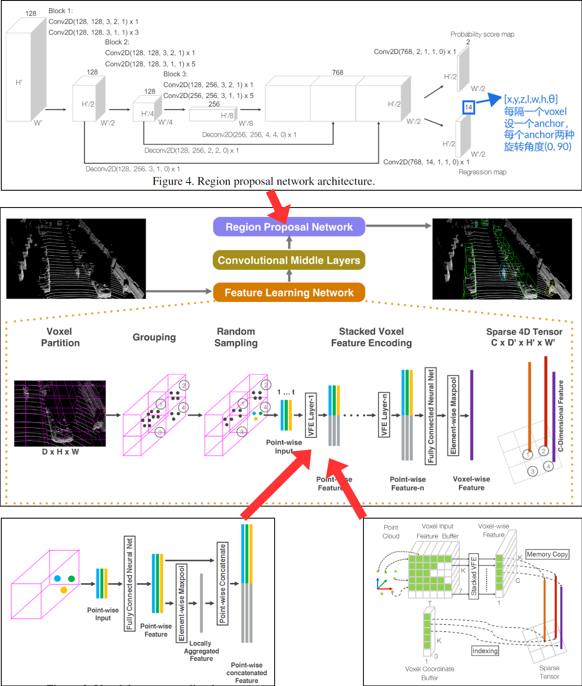
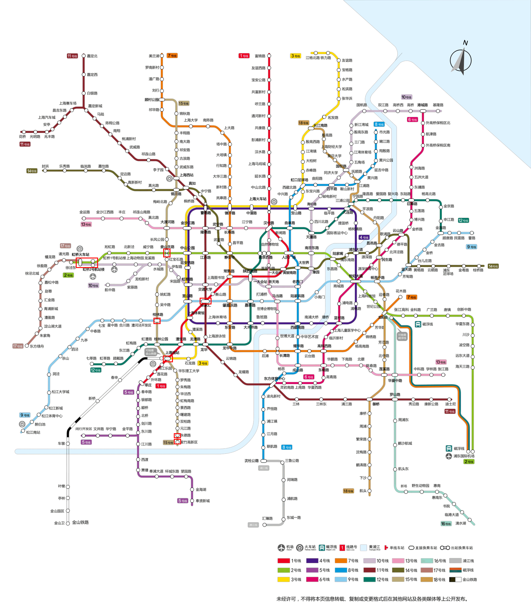
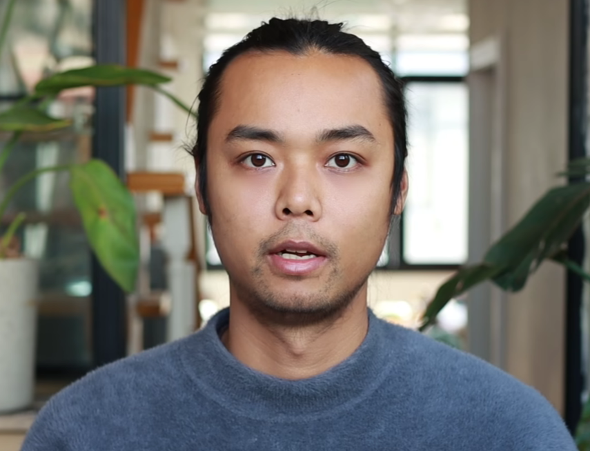

# Summary 20241007

[toc]

## 01 学习：Transformer

这次按照计划，继续开展了Transformer后续相关组件的学习，主要包括：多头注意力机制、位置编码和自注意力机制。

到此，经典Transformer的所有组件就基本都学习完了，下周正式进入Transformer的整体学习。

### 01.01 多头注意力机制MultiHeadAttention



首先，需要陈清的是：多头注意力融合了来自于多个注意力汇聚的不同知识，这些知识的不同来源于相同的查询、键和值的**不同的子空间**表示，而非将相同的query/key/value经过不同的线性变化级联后再经过线性变化压缩为原长度。

在具体的作用上，可以把多头注意力机制的"MultiHead"比作CNN中的多个卷积核。:label:

假设有以下具体的参量：

| 名          | 值   | 名         | 值    |
| ----------- | ---- | ---------- | ----- |
| batch_num   | 2    | num_heads  | 5     |
| num_hiddens | 100  | valid_lens | [2,3] |
| query_size  | 5    | query_num  | 4     |
| key_size    | 10   | key_num    | 6     |
| value_size  | 15   | value_num  | 6     |

则普通注意力机制和多头注意力机制的对比如下：



### 01.02 自注意机制SelfAttention

一句话来说的话，就是在（q, k, v）的关系中，查询、键和值都是相同的输入向量X，经过注意力汇聚函数处理后，输出也是相同维度和尺寸的向量。类比CNN，SelfAttention更善于提取序列和全局信息，而CNN更善于提取图像和局部信息。同时，SelfAttention需要的训练量很大。



对了，通过观察发现，就像基本的普通注意力机制一样，不同于卷积操作，自注意力机制会导致位置信息的丢失，因而需要以下的位置编码。:thinking:

### 01.03 位置编码PositionEncoding(PE)

为什么需要位置编码？Transformer是一次性将序列输入，当然输入中需要附带位置信息。

位置编码传统上分为绝对式和相对式。这里总结学习了最为经典的三角函数绝对式的位置编码。

首先，明确位置编码并没有用到特征的值，而是用到了其长度和索引信息。

对于序列长度为n，特征数为d的输入序列**X** (n,d), 现在计算其位置编码**P** (n,d)，并将**X+P**作为最终的输出。

$$P = \begin{cases} PE{pos,2i}=\sin(\frac{pos}{10000^{\frac{2i}{d}}})\\ PE{pos,2i+1}=\cos(\frac{pos}{10000^{\frac{2i+1}{d}}})\\0\leq pos\leq n-1\\ 2i\leq d-1\; or \; 2i+1\leq d-1\end{cases}$$

$$w_i=\frac{1}{10000^{\frac{2i}{d}}} \quad or \quad\frac{1}{10000^{\frac{2i+1}{d}}}$$

相当于：

- 对于同一时间步，维度越高，编码的频率越低；

- 对于同一维度，不同时间步，编码表示为在同一频率曲线上的不同位置；

对于上述表示，可以对比**数字的二进制编码**来理解（之所以实际中不用二进制来进行位置编码，可能因为这对存储太奢侈了）：:yum:

|                         三角函数编码                         |                          二进制编码                          |
| :----------------------------------------------------------: | :----------------------------------------------------------: |
|  |  |

通过编写程序进行验证：

```python
class PositionalEncoding(nn.Module):
    """位置编码"""
    def __init__(self, num_hiddens, dropout, max_len=1000):
        super(PositionalEncoding, self).__init__()
        self.dropout = nn.Dropout(dropout)
        # 创建一个足够长的P
        self.P = torch.zeros((1, max_len, num_hiddens))
        #(1000,32) 利用了广播机制
        X = ( torch.arange(max_len, dtype=torch.float32).reshape(-1, 1) /
             torch.pow(10000, torch.arange(0, num_hiddens, 2, dtype=torch.float32) / num_hiddens) ) 
        self.P[:, :, 0::2] = torch.sin(X)
        self.P[:, :, 1::2] = torch.cos(X)

    def forward(self, X):
        X = X + self.P[:, :X.shape[1], :].to(X.device)
        return self.dropout(X)
```

结果如下，可以看到维度越高，频率越低。



另外，不加以证明的，这种PE编码方式有以下特点：

- $PE_{pos}与PE_{pos+k}$线性相关
- $PE_{pos}\cdot PE_{pos+k}$的结果可以用以表示相对位置：k越大，结果越小
- 每个时间步的编码向量是唯一确定的
- 对于不同长度的句子，只要特征数相同，相邻时间步之间的距离就相同
- 编码范围有界 [-1,1]
- 通过正余弦交替，使得每个维度都能够保持一定的正交性，确保了位置编码在不同维度上的独立表示，这有助于模型更清晰地区分和学习来自不同位置的特征。


## 02 学习：NeRF 神经辐射场三维重建

之所以会看这个，一是之前有听学长聊过，二是这次参观IRMV实验室时也听郑博提到过，所以就补了一下。:smirk:

输入2D图像，经过内外参并随机采样得到射线，在射线上均匀采样得到粒子点，经正余弦编码增加高频信息后输入8-MLP得到每个点的RGB和密度$\sigma$, 由密度再进行一波采样，将得到的点和原先的点合并后重复上述操作，最终得到新的每个点的RGB和$\sigma$，最后由每个点的XYZ,RGB, $\sigma$进行体渲染得到新的2D图像。

模型简单，经过了粗精两轮8-MLP，训练推理较慢，且没有泛化能力




## 03 学习：VoxelNet

上次在看PV2BEV综述的时候，作者通过举例比较各技术路线算法，表明了点云体素化操作相比于直接对点云操作有着诸多的优点，这引起了我对于点云体素化路线的重视，另外，之前只知道要把点云体素化后提取特征，但是具体操作不甚清楚，这次通过阅读VoxelNet论文也补充了这方面的知识，主要涉及：

**①点云体素化：**主要涉及一个点云划分分组以及每个体素内点云数量阈值T的问题

**②对每个体素提取特征：**这里主要用了Element-wise max pooling融合了特征，并把该特征与原特征级联，经过多层VFE层后，再经过一次max pooling得到每个体素的特征(且这些特征是Non-handcraft)；在过程中，为了充分利用GPU，作者设计了一种融入hash表操作的矩阵块级别的efficient implement

**③中层卷积提取特征：**没什么好说的

**④RPN网络得到分类和bbox：**这里使用了FPN机制，和上采样复原，这丰富了不同尺度的特征，便于检测不同尺度的物体




# Appendix

## 01 收获：上海之旅



①地铁线路：${\color{#88BB19}{2号线}}和{\color{#BBAA77}{15号线}}$：${\color{#88BB19}{虹桥火车站 \rightarrow 虹桥2号航站楼 \rightarrow 娄山}}  {\color{#BBAA77}{关路 \rightarrow 上海南站 \rightarrow 永德路（集美学居酒店） \rightarrow 紫竹高新区（上交闵行校区）}}$

②上交的哈喽单车深蓝色的不推荐骑乘，建议浅蓝版；美食推荐：吉姆丽德...； 景点推荐（也许有）：田子坊

③实验室硕士名额大多分配给了保研者，而对考研者的筛选会更加严格

④实验室也有做具身智能、强化学习、模仿学习、人形机器人、3D视觉重建的

⑤研究生课程基本自选，会分行政班，但意义不大；同时，相同的课程可以线上抢不同的老师

⑥IRMV研一也会开始做项目

⑦入学学业奖学金一等12000，二等6000，按月发

⑧宿舍随机分配，但可以预约

⑨社团研究生也有，但在IRMV没有太多时间参加

⑩硕转博可以，但需要补足博士学分；硕博连读不可以


## 02 启程：冥想(meditation)练习（李冉）

(呃，这个up气质有点像陈昕学长 :dog:)

更好的冥想:thinking::

①冥想习惯：用笔安排好冥想时间，养成冥想的习惯；

②冥想时间：优先级：早起后、午休后、（晚睡前）；

③冥想地点：安静、独处、固定；

④冥想条件：宽松衣服（上身凉爽、下身温暖） 可能可以使用到眼罩或耳塞；

⑤手机情况：放置在视域外，打开勿扰模式。



主动感受身体是冥想的基石：

①**身体扫描：**按顺序按区域(可以先右半后左半)的依次感受身体各个部位（容易集中注意力）；

②线索暗示：比如主动问自己，身体上哪个地方放松哪个地方紧张，哪个地方冷哪个地方热等等；

③自由感受：这种最为贴近自然，但也比较无聊。


对于身体某些部位（如胯部、后脑勺）感受不明显，这很正常，可以通过身体扫描、动态冥想、加强运动、冥想前**拉伸**、**先紧后松**来改善。也就是说**运动+冥想**是绝配

另外我发现，对于我自己而言，睡前先躺着冥想做身体扫描，有助于我后续的睡眠(之前睡觉时总会思绪横飞)


## 03 记录：上海交通大学学生存手册

有幸能了解到这本小册子，里面有许多金句引起共鸣，现摘录少许如下：:bookmark_tabs:

1. **至少在读过本书之后，各位读者应该能够有勇气、有智慧，去发现并挑战那些比上课更为重要的追求。**
2. **国内绝大部分大学的本科教学，不是濒临崩溃，而是早已崩溃。**
3. **如果一个人把政策评分作为自己的至高追求，那么他就是这个政策的牺牲品。**
4. 大学四年留给你的是你的人生，在你毕业之时，那一串苍白的分数其实就已经作废了。
5. **一个真正有志于建造科学大厦的人，是不应抱着一块儿砖头精雕细琢的。**
6. 学习知识的目的是为后继的知识铺垫，以及培养创造性的思维。
7. 所以，对于生计无虞的同学们，我们更应该做的不是为了蝇头小利在最底层的劳动中苦苦挣扎， 而是应当积极地利用这份时间来提高我们的身价，为今后出卖高价值劳动创造机会。
8. **我们真正投下的有价值的筹码，是时间。面对着足以改变你人生轨迹的黄金时间，你是否感到了它的沉重？你又是否想过要如何计划这笔巨额投资？**
9. 成功人士往往会津津乐道于他们在校期间锻炼出的专业素养，但几乎没有成熟（甚至不需要成功）的人，喜欢炫耀自己当年高数考了年级第一。
10. 费时费力不讨好，但是碍于面子不好推脱的临时工作。学校很多老师或者学生领导，喜欢把人当壮丁使唤。但是你要时刻清醒，你的身份不是临时工。"帮忙救急" 和"工作" 这两个概念必须区别对待。
11. **一般来说，一项任务的价值，取决于它在时间尺度上的作用效率。**花同样的功夫，我们应该尽量多做那些对整个人生都产生正面影响的事情，少做对中期的未来产生影响的事情，不做那些只对近期产生影响的事情。当然，产生负面影响的事是最应该避免的。**从这个意义上说，花适当的时间锻炼身体能让我们终身受益，值得做；**但是即便只花同样时间，我们也不应该打游戏，因为那只能获得转瞬即逝的空虚的精神愉悦。
12. **无知的兴趣一定是苍白的。**
13. 顺便说一下，在绝大多数高新技术领域，对于教科书的选择，我们能接受的下限是外文作者的中文翻译。尝试阅读所谓国内专家的专著只会让你的思维变得更为混乱。
14. 但归根结底，发表文章需要的是你的原创性思考。
15. 成功的人在不同的地方有不同的成功方式，但是失败的人在不同的地方会有完全相同的失败方法。海的那边，一样很残酷。
16. 那么你来到交大的目的，是为了学习知识么？对于大部分人，好像也不是。（否则你完全可以自由旁听课程，而不交学费）
17. **某个环境的条件如何如何之好并不是你去到某个环境中的理由，你能从这个环境中获得什么样的成就，才是你前往某个环境的原因。**
18. 因为在科研领域，做不到最好，就意味着你没有任何用途，你只有做出全世界最前沿最顶尖，别人没有做出来过的东西，才能算是科研。
19. 博士文凭本身，并不会提高你的身价。关于读博士，我们一再声明：不想做学术的人请务必不要读博士学位。 当然，每年也有很多人不信邪地去读了博士，于是我们可以读到类似"北美wsn的奋斗血泪史"。
20. 一个事实是，设置博士学位的唯一目的是培养顶尖科研人才。这个学位不考虑你的就业前景，不考虑你精神所能承受的压力，它唯一考虑的， 是你在某一个领域做出了多大的开创性贡献。
21. 所以，如果你不是醉心学术，没有浓厚的兴趣，或者不觉得自己以后会以研究为生，那么读博士之前最好再考虑一下。
22. **你经过深思熟虑后投身的专业，必须要能让你获得最大程度的智力满足。**
23. 我们应该做什么？做研究！而且要做一流的研究！如果你肯努力，那么做出好的研究成果并非不可能。
24. 很多人在申请时由于信息极度 缺乏导致了极度不自信，强烈想找到一个稳定的支柱。而中介正是利用了这种心态，给你展示他们那化腐朽为神奇的"成功案例"，并用各种"无效退 款"的保证让你安心。然而这一切都是骗局。
25. 新进入研究领域的学生，必须学会如何自己归纳知识结构。 如果有人问及你正在做的工作，你应该能像从Google Earth 中找自己家一样，把自己的工作在一年、 五年、十年、甚至整个世纪的时间尺度下，并且清晰、准确、不带偏见地勾勒出你正在做的工作在整个学科中的位置。可以说，清醒的位置感和准确的方向感，是比雄厚的基础知识更为重要的成功要素。**在研究中，知道做什么比知道怎样做更为重要。**
26. 我们在研究起步阶段，应该仔细阅读该领域的权威教科书。
27. 当我们对框架有了一定认识之后，就可以选择其中的一个或者几个分支定为自己中短期的研究课题。继而开始综述（ review ）类文章的阅读。综述类文章的参考文献列表也极具参考价值。
28. **三条原则可以简单地衡量一个理论的内在价值：新颖、简单、普适。**
29. **在同等工作量的前提下，明智的进度控制应该是把自己的全部工作平均分配在各次课上提交。即便你已经做完了更多，也必须像说评书一样娓娓道来，说一半藏一半，不要一股脑呈现完。**
30. 当大家天天等着系里面召开导师选择的会议的时候，你应该已经在导师的办公室和他谈谈今后两年的计划。
31. 你没有更多的选择，于是才继续读硕士，寄希望于给自己一段可以继续努力的时间。但是，在这段时间里，**如果你再不认真思考（很多优秀的人本科时候就做过这些思考了）， 那么可能你还会浑浑噩噩地留校读个博士。**再之后呢？你打算继续读壮士或是烈士吗？
32. 因此，问清楚项目周期和工作任务是决定加入的必须前提。我们必须明白自己头上的工作，究竟在哪个层面对自己有帮助。要知道，老师"私活"的商业性质多于学术性质，甚至可以因商业牺牲学术原则。
33. 好导师和你的关系如君子之交淡如水，言谈举止之间就让你心悦诚服；差导师只能通过吃饭等小恩小惠而保证你继续给他打工。
34. **团队协作精神，应当是各展所长、互为补充的高效率工作。我们不能以"团队合作"的名义，迁就或容忍那些低效率、无责任心的合作者。**
35. 努力提升实力才是解决之道。在国内生存，你最缺的不是户口，而是实力。
36. 我们选课并非选课程，而是选上课老师。但如果有人认为选什么老师无所谓，那就大错特错了。
37. 而且，越是出题的老师，就越会避嫌而对考点三缄其口。相反， 没有出题的老师也许会凭经验押题或者是看到考卷后间接地把考点告诉大家。
38. **广占坑，占好坑**
39. 另外，你还可以适当引用你上课老师过去发表过的论文作为参考文献。这种手段更是有立竿见影的加分效果！
40. 最基本地，你要确保你的小论文上到处都有足够翔实的参考文献。你甚至不需要读这样的参考文献。老师也不会太介意你是否在市场营销学的论文中引用热力学第二定律研究的新成果。
41. 在学期结束前，你可以提交一个一两页的一个看上去很认真的论文提纲给老师阅读（一定要让这个提纲看上 去很认真），并且让他提提建议！要知道，写这样一个提纲，根本不需要花费超过一个小时的时间！
42. **一位懂得这门课程的朋友。**
43. 在谈话中，最佳的切入点是学术。你要尽可能地讨论学术方面的问题，而不是去强调你要出国，你要保研。
44. 我们对待选修课的态度应该是鲜明的：要么拿90+的分数，要么挂掉。
45. 在万方数据库上查找相关方向关键词，多找一些期刊，看每个期刊每月能 刊登多少篇文章。如果一个月有100篇以上或更多，那想也不要想，这期刊一定是水刊。
46. 在致谢里写上牛人，可以给自己撑腰。


