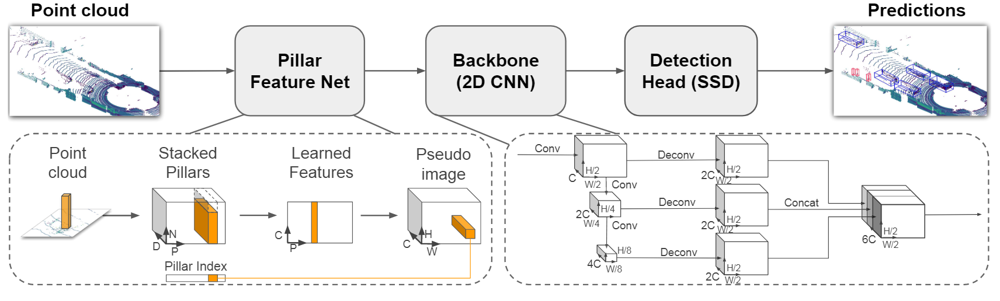

[toc]

# Summary 20241014

## 01 学习：PointPillars

PointPillars的流程图如下：

**①初步特征提取阶段：**相比与VoxelNet，它不对单个Voxel进行处理，而是对单个Pillar进行处理。

**②Backbone阶段：**它采用类似于FCN的方式，采集不同尺度的特征，上采样后进行拼贴。

**③检测头阶段：**它采用SSD作为检测头进行2D Pseudo-Image上的目标检测，3D物体的高度则通过再一轮次的回归得出。

  另外PointPillars有以下特点：

①对pillar进行编码，在处理的过程中融入PointNet的思想，并构建Pillar index，对Stacked Pillars做集中处理，达到了较快的检测速度，在KITTI数据集上，相比与VoxelNet的4.4Hz，PointPillars达到了62Hz，且保持了不错的精度;

②比较特别的是其分类损失函数使用了Focal loss：$L_{cls}=-\alpha_{\alpha}(1-p^{\alpha})^{\gamma}\log p^{\alpha}$ 而非binary cross entropy loss;

③训练方便，可以做到端到端训练。

## 02 调研：A Survey：Multimodal-BEV 3D Detection 

具体内容见A Survey：Multimodal-BEV 3D Detection文件

# Appendix

## 01 总结：撰文上采样

总结了最近邻插值/双线性插值/反卷积等常见的上采样方式，并撰写如下博客：

[【上采样】关于最近邻插值/双线性插值/反卷积这一篇就够了-CSDN博客](https://blog.csdn.net/luokang21/article/details/142756875)

## 02 闲暇：冥想练习

①关于坐姿

坐姿的要求：稳定，舒适，挺拔           

在坐姿时，如若盘腿，将手放在大腿稍靠后的位置，这样不容易弯腰

另外无论何种姿势，务必使得膝盖低于臀部

②关于动态冥想

有三种常见的动态冥想方法：低头抬头；侧向摆腰；躯干旋绕。

③关于正念的定义

> 正念是对**当下**的**实相**(身体、内心)保有**觉知**(主动、不加批判)。

