[toc]

# A Survey：BEV 3D Object Detection

## 0  Overview

:rocket:经过调研，截止至2024年11月，将**BEV 3D Object Detection**的主流方法按照模态分为**Camera-based / LiDAR-based / Multimodal-based**三大分支，其中调研的重点在多传感器融合分支。在各个分支中按照是否使用**Transformer**等情况又可以继续细分。将各细致分类表示为**Tag**如下：

| Tag                                    | Meaning               |
| -------------------------------------- | --------------------- |
| C | 使用了Camera模态      |
| L | 使用了LiDAR模态       |
| T  | 使用了Transformer结构 |

现将调研的全部方法列表如下：

| Order | Method          | Tag                                                          | NDS   |
| ----- | --------------- | ------------------------------------------------------------ | ----- |
| 1     | LSS             | C                       | /     |
| 2     | BEVFormer       | C T | 0.569 |
| 3     | BEVFormer v2    | C T | 0.634 |
| 4     | VoxelNet        | L                       | /     |
| 5     | PointPillars    | L                       | 0.453 |
| 6     | BEVFusion       | C L | 0.761 |
| 7     | IEI-BEVFusion++ | C L | 0.776 |
| 8     | BEVFusion4D     | C L T | 0.772 |
| 9     | EA-LSS          | C L | 0.776 |
| 10    | Sparse LIF      | C L T | 0.777 |
| 11    | MV2DFusion      | C L T | 0.788 |

上述方法的关系如下图：

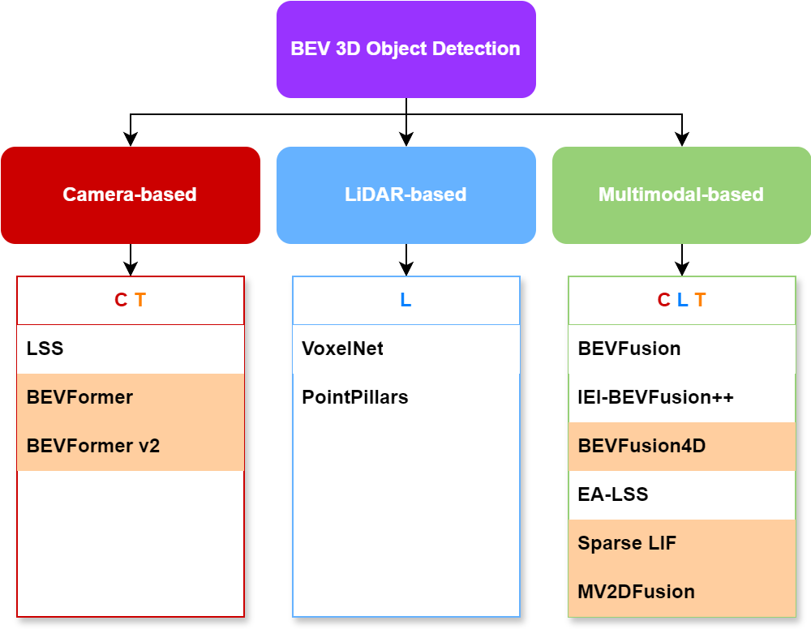

经过对比阅读，可以总结出以下一些共性的要点：

| Order | Key Point                                                    |
| ----- | :----------------------------------------------------------- |
| 1     | BEV空间在特征表达上能比较好的保留来自相机的语义信息和来自雷达的几何信息，因而成为多模态融合的焦点 |
| 2     | 在多模态融合处理时，对LiDAR端BEV特征的改进较少               |
| 3     | 在涉及时序时，BEV特征的对齐很少融合车载imu的数据，而大多是依靠软件算法性质的对齐方法 |
| 4     | 在众多PV2BEV方法中，基于Depth和Transformer的路线是研究热点   |
| 5     | 在对LiDAR端处理时，voxel和pillar等具有采样性质的处理方式相比于直接处理pcds的方式更加流行 |
| 6     | 有许多最新的方法，虽然达到了较高的性能，但有的是对原有的经典模型打补丁，欠缺统一的美感 |
| 7     | 许多方法涉及逆向投影的操作，这通常是为了获取原始的稀疏数据   |
| 8     | 没有应对特殊情况(e.g. 雷达失灵)，而动态调整网络结构分支的操作 |
| 9     | 多传感器融合处理时，主要使用Camera和LiDAR，而RADAR应用较少   |
| 10    | 一般来说涉及相机显式视角转换的方法更加Dense，而融合了Transformer的方法(query-paradigm)更加Sparse，因而享有更低的延时和更高的帧率 |
| 11    | queries的数据依赖性、分模态独立性、位置/语义划分性十分重要（但是位置与语义并非完全独立！） |
| 12    | 在生成具有Camera指导性/LiDAR指导性的query时，缺乏前置质量校验 |
| 13    | 各模态特征的自适应融合对提高鲁棒性和性能有重要的作用         |
| 14    | 在最新的query-paradigm中，在bev空间的融合显得不那么重要了，而是设法生成一个优质的融合query去对各模态初步提取的特征进行注意汇聚或被这些特征更新，最后经任务头输出结果 |
| 15    | 建立稀疏特征的索引表，将稀疏特征汇聚成密集特征集中处理，提高计算效率 |
| 16    | 加入前置的对原始数据进行校验的步骤是十分重要的               |

---

## 1 Camera-based Methods

:moon:基于相机的方法列表如下：

| Order | Method       | Tag                                                          | NDS   |
| ----- | ------------ | ------------------------------------------------------------ | ----- |
| 1     | LSS          | C                       | /     |
| 2     | BEVFormer    | C T | 0.569 |
| 3     | BEVFormer v2 | C T | 0.634 |

### 1.1 PV-BEV Survey

> Vision-Centric BEV Perception: A Survey

:star:经过**PV2BEV**的调研，总结出主要的PV2BEV方法有基于geometry、基于depth、基于MLP和基于transformer四个分支。下图中，总结了这四大技术路线的代表方法和优缺点。实际上，目前基于depth和基于transformer的路线更有应用前景。

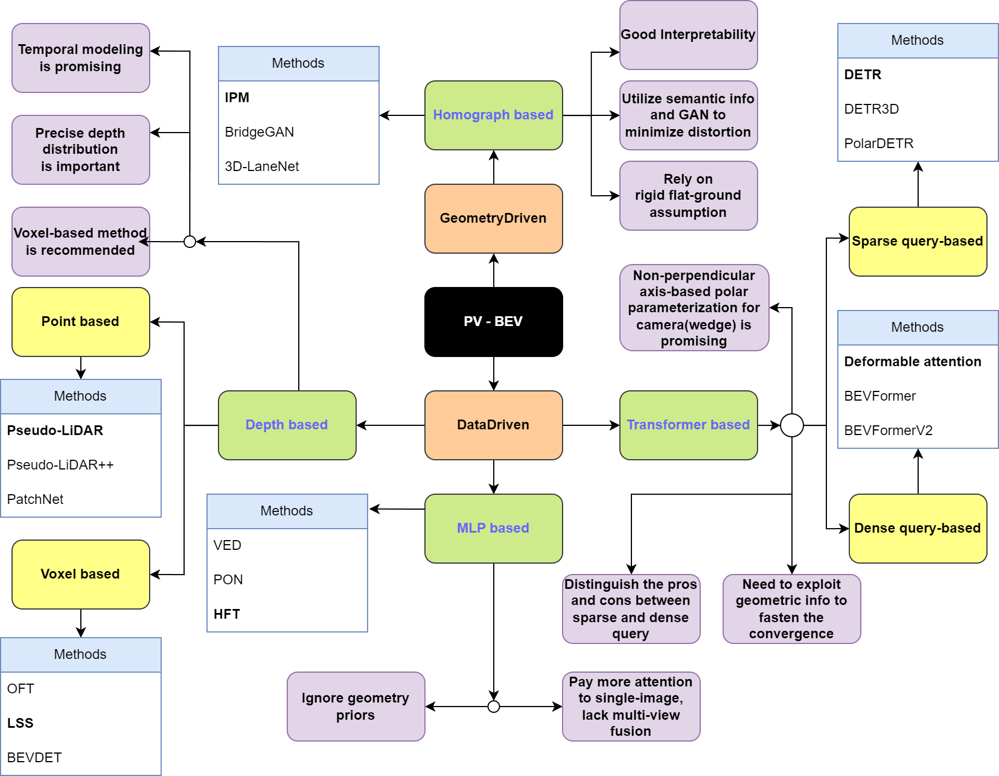

### 1.2 LSS C

> Lift, Splat, Shoot: Encoding Images from Arbitrary Camera Rigs by Implicitly Unprojecting to 3D

:star:LSS(仅分析LS)通过将图像特征反投影到3D空间生成伪视锥点云，通过网络提取云点的深度分布特征和图像语义特征并对深度信息进行估计(Lift)，最终将点云特征转换到BEV空间下进行特征融合和后续的语义分割任务(Splat)。

#### 1.2.1 主要流程

> **输入：**
>
> 多视角的二维RGB图像, 内外参等
>
> **输出：**
>
> BEV特征图

**${\color{#E16B8C}{①}}$Lift:** Latent Depth Distribution流程：

用EfficientNet对每幅图像分别处理，得出射线方向的深度分布**α**以及像素级的语义信息**c**，两者做外积，作为multi-plane image的通道方向的值。

|  | 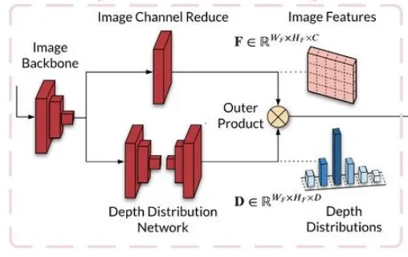 |
| ------------------------------ | ------------------------------------------------------------ |

**${\color{#E16B8C}{②}}$Splat:** Pillar Pooling流程：

1. 对每个相机得到的经lift处理后的锥状体点云;
2. 经相机内外参转化到车体坐标系;
3. 经过类似于PointPillar的pillar划分和求和池化后转化为CHW张量;
4. 经过CNN推理出BEV特征图。

| 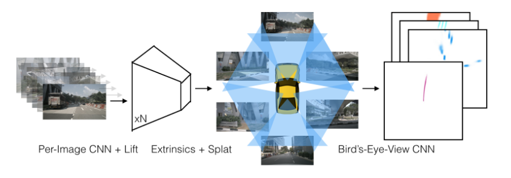 | 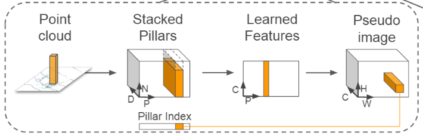 |
| ------------------------------ | ------------------------------------------------------------ |

#### 1.2.2 优缺点和改进方向

| 序号 | 优点                    | 缺点                    | 改进                    |
| ---- | :----------------------------------------------------------- | :----------------------------------------------------------- | :----------------------------------------------------------- |
| 1    | **多视角融合：**LSS能够有效地融合来自多个相机的图像数据，利用反投影，生成统一的鸟瞰图表示 | **深度估计的不确定性**：由于LSS依赖于隐式深度估计，模型在处理深度信息不明确或存在歧义的场景时可能会表现不佳 | **深度估计的改进**：可以尝试引入几个RGB-D相机穿插其中来提高深度估计的准确性，特别是在低光照条件下 |
| 2    | **隐式深度估计**：通过Lift阶段，LSS能够在没有显式深度信息的情况下，生成潜在的投影射线方向深度分布，从而在3D空间中进行有效的特征表示 | **图像质量依赖大**：LSS在低光照或雨雾条件下的性能显著下降，这主要是由于图像质量的下降，影响了深度估计的准确性 | **夜间性能优化**：研究如何在低光照条件下提高模型的性能，例如通过图像增强技术或引入夜视传感器 |
| 3    |                                                              | **处理速度慢**：LSS在“plat阶段采用了点柱池化（Pillar Pooling）技术，通过将点云转换为柱状体并进行池化处理，但是多视角的PV转BEV还是太花时间了，难以满足实时性要求 | **多视角融合：**利用空间transformer的注意力机制对多视角全视域的图像进行统一处理 |
| 4    |                                                              | **多视角融合不充分：**Lift阶段是分别处理每个图像的信息，难以做到跨视角，全视域的统一处理 | **提升处理速度：**利用更加先进的处理方法如(BEVFusion中提出的)，来提高帧率 |

### 1.3 BEVFormer C T

>BEVFormer: Learning Bird's-Eye-View Representation from Multi-Camera Images via Spatiotemporal Transformers

:star:本文所用传感器是多视角的RGB相机，通过引入grid-shaped BEV queries、spatial cross-attention(SCA)、temporal self-attention(TSA)并融合transformer-encoder框架，实现了跨视图，跨时间的BEV特征提取，且在基本没有降低帧率的情况下，提高了下游任务的准确率。

#### 1.3.1 主要流程

> **输入：**
>
> 多视角的二维RGB图像, 各传感器内外参
>
> **输出：**(取决最后的任务头，而对于3D目标检测而言)
>
> ①概率得分图(2D)，表示每个边界框内物体类别概率
>
> ②边界框回归图，包括中心坐标、长宽高和偏航角

${\color{#E16B8C}{①}}$**提取各相机特征：**通过backbone(如ResNet-101)提取各视图下的特征$F_t$；

${\color{#E16B8C}{②}}$**TSA融合优化查询：**通过TSA时域(基于DeformAttn)自注意力机制优化提供给SCA的查询；

其中： **q:** Q，**k：**Positon，**v：**(aligned $B_{t-1}'$, Q)

${\color{#E16B8C}{③}}$**SCA全视图提取空间信息：**通过lift和project操作，得到各图像上的2D参考点，并作为键运用SCA(基于DeformAttn)提取特征；

其中：**q:** Q，**k：**reference 2D points，**v：**$F_t$

${\color{#E16B8C}{④}}$**全连接进一步提取BEV特征：**通过带残差的全连接网络进一步抽象提取出BEV特征；

${\color{#E16B8C}{⑤}}$**下游任务：**经过不同的任务头得到不同任务的结果。

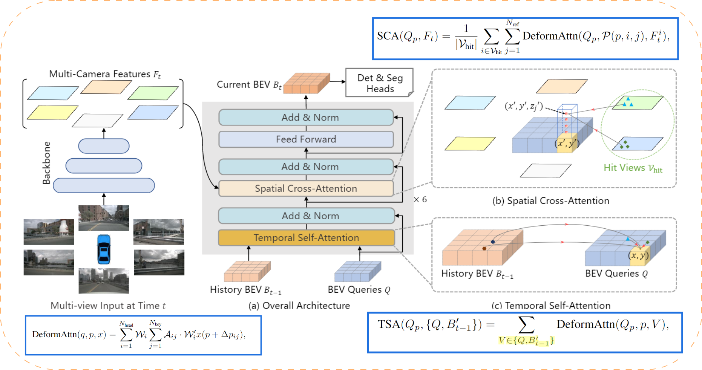

#### 1.3.2 优缺点和改进方向

| 序号 | 优点                    | 缺点                    | 改进                    |
| :--- | :----------------------------------------------------------- | ------------------------------------------------------------ | ------------------------------------------------------------ |
| 1    | **时域高效性**：使用自注意力机制充分融合时间信息而非简单的堆叠，在基本保持帧率的情况下提高的准确率 | **空域处理不统一：**需要把3D锚点重投影回2D平面运动DeformAttn处理，一方面影响效率，另一方面使得处理的质量验证依赖于重投影的准确率 | **重新设计统一的3维SCA：**设计能直接在特征层面上处理SCA而不要重投影回去再提取特征回来 |
| 2    | **空域高效性：**并非简单的分别处理各相机的特征，而是通过SCA进行处理，提高了速度和效果 | **对小物体和远处的物体效果欠缺：**由于几乎没有尺度变换操作，对这些物体的检查效果欠缺 | **改进TSA：**可保持更长时间尺度的信息，综合运用GRU或LSTM的策略加强时间信息的融合 |
| 3    | **深度鲁棒性：**这种提取方式并不依赖于深度信息和三维优先级   | **特征提取不统一：**使用现有的backbone提取图像特征，整个体系不够统一，训练速度也受到阻碍 | **使用FCN策略：**通过多尺度的特征提取，提高对小物体的检测效果 |
| 4    | **速度推理与遮挡检测突出：**由于使用了时间信息，其在推理速度和检测严重遮挡物体上有明显改善 | **无法兼顾长时信息：**由于只融合了前一帧的信息，对长时间跨度的检测支持性不佳 | **多传感器融合：**尝试将LiDAR融入框架，加强模型对几何特征的把握能力 |
| 5    | **不需要使用NMS：**运用Deformable DETR检测头，不需要NMS操作，提高了效率 |                                                              |                                                              |

### 1.4 BEVFormer v2 C T

> BEVFormer v2: Adapting Modern Image Backbones to Bird's-Eye-View Recognition via Perspective Supervision

:star:本文在BEVFormer的基础上，重视了image特征提取的backbone​，从而提出了一种投影视图直接监督方法和两阶段的BEV检测器。相当于给BEVFormer在SCA模块二维重投影操作打了一个补丁，使得从投影端得到的特征也直接参与解码，损失计算不那么间接，从而加速了模型收敛，并将准确率提高了2~3个百分点。

#### 1.4.1 主要流程

> **输入：**
>
> 多视角的二维RGB图像, 各传感器内外参
>
> **输出：**(取决最后的任务头，而对于3D目标检测而言)
>
> ①概率得分图(2D)，表示每个边界框内物体类别概率
>
> ②边界框回归图，包括中心坐标、长宽高和偏航角

${\color{#E16B8C}{①}}$**提取各相机特征：**通过backbone(如ResNet-101)提取各视图下的特征$F_t$；

${\color{#E16B8C}{②}}$**投影3D头处理：**通过Perspective 3D Head提取得到3D边界框，将其编码为Object Queries；

${\color{#E16B8C}{③}}$**查询混合：**通过对整个数据集进行学习，得到Learned Queries(Content queries和positional queries)，与Object Queries混合后得到Hybird Object Queries；

${\color{#E16B8C}{④}}$**SCA处理：**将BEV Queries(**q**)和图像特征(**k,v**)输入SCA，得到当前未修饰的BEV特征；

${\color{#E16B8C}{⑤}}$**改进TSA处理：**将BEV特征与过往高跨度的多帧BEV特征融合进入TSA处理得到当前修饰好的$B_k$；

${\color{#E16B8C}{⑥}}$**解码器与下游任务：**将$B_k$作为**k**和**v**，将Hybird Object Queries作为**q**，输入DETR解码层后得到预测结果。

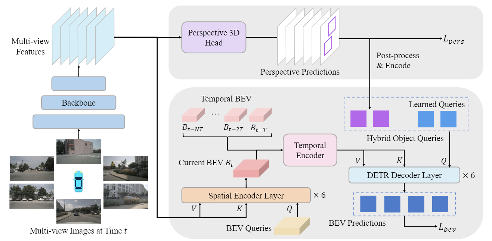

#### 1.4.2 优缺点和改进方向

| 序号 | 优点                    | 缺点                    | 改进                    |
| :--- | :----------------------------------------------------------- | ------------------------------------------------------------ | ------------------------------------------------------------ |
| 1    | **收敛速度和准确率提升：**从结果上看，加入了perspective supervision后，模型训练收敛速度和预测准确率有所提升 | **整体不够统一：**感觉还是没有从根本上解决SCA重投影的问题，而是另加了一个投影监督分支来弥补 | **重新设计统一的3维SCA：**设计能直接在特征层面上处理SCA而不要重投影回去再提取特征回来而不是通过此种打补丁的方式 |
| 2    | **首次对image backbones下功夫**：这是首篇对image backbones进行研究的文章，引起了对2D backbone与3D detection间隔阂的思考和启示 | **投影监督内部不统一：**仅是在2D backbone前加入了一个perspective 3D detection head来监督，模块之间还是比较割裂的 | **使用FCN策略：**通过多尺度的特征提取，提高对小物体的检测效果 |
| 3    | **更加充分地利用了投影视图：**补充了perspective supervision，增加了对原始数据的直接利用，减少了在数据传递链上的损失 | **对小物体检测的不够彻底：**虽然在Hybird Queries阶段融合了数据级的信息以弥补透视投影端在小物体和遮挡方面的不足，但效果太过微弱 | **多传感器融合：**尝试将LiDAR融入框架，加强模型对几何特征的把握能力 |
| 4    | **适应性好：**对应各种不同的2D image backbones，都能够做到对性能的提升 |                                                              |                                                              |

---

## 2 LiDAR-based Methods

:moon:基于雷达的方法列表如下：

| Order | Method       | Tag                                    | NDS   |
| ----- | ------------ | -------------------------------------- | ----- |
| 1     | VoxelNet     | L | /     |
| 2     | PointPillars | L | 0.453 |

### 2.1 VoxelNet L

> VoxelNet: End-to-End Learning for Point Cloud Based 3D Object Detection

:star:VoxelNet通过将点云分割成等间距的三维体素，并通过新引入的体素特征编码层VFE将每个体素内的一组点转换为统一的特征表示，将特征提取和边界框预测统一到单个端到端可训练的深度网络中。VoxelNet在KITTI数据集上的实验表明，其在车辆、行人和自行车的检测任务上均优于"以往"的基于LiDAR的三维检测方法。

#### 2.1.1 主要流程

> **输入：**
>
> 点云，包括三维坐标和反射率
>
> **输出：**
>
> ①概率得分图，表示每个体素内是否存在目标的概率
>
> ②边界框回归图，包括中心坐标、长宽高和偏航角

**${\color{#E16B8C}{①}}$点云体素化：**主要涉及一个点云划分分组以及每个体素内点云数量阈值T的问题；

**${\color{#E16B8C}{②}}$对每个体素提取特征：**这里主要用了Element-wise max pooling融合了特征，并把该特征与原特征级联，经过多层VFE(voxel feature encoding)层后，再经过一次max pooling得到每个体素的特征(且这些特征是Non-handcraft)；在过程中，为了充分利用GPU，作者设计了一种融入hash表操作的矩阵块级别的efficient implement；

**${\color{#E16B8C}{③}}$中层卷积提取特征：**没什么好说的；

**${\color{#E16B8C}{④}}$RPN网络得到分类和bbox：**这里使用了FPN机制，和上采样复原，这丰富了不同尺度的特征，便于检测不同尺度的物体。

#### 2.1.2 优缺点和改进方向

| 序号 | 优点                    | 缺点                    | 改进                    |
| ---- | :----------------------------------------------------------- | :----------------------------------------------------------- | :----------------------------------------------------------- |
| 1    | **端到端学习**：将特征提取和边界框预测统一在一个端到端的可训练深度网络中，避免了手动特征工程引入和复杂的多阶段训练 | **运行速度慢**：尽管VoxelNet在处理稀疏点云时表现高效，但其多层连续的VFE特征提取操作和3D卷积操作仍然具有较高的计算复杂度。这使得其在KITTI上仅有4.4Hz | **优化特征表示：**VoxelNet相比于PointPillars等网络而言，在特征提取上还可以做到更加高效，比如使用自适应的体素大小 |
| 2    | **高效的特征表示**：通过引入Voxel特征编码（VFE）层，VoxelNet能够在体素内进行点间交互，从而学习到复杂的局部3D形状特征，同时避免了handcraft特征 | **内存消耗大**：由于需要将点云数据转换为高维的体素表示，对比与pillars等表示而言，Voxel在内存消耗方面可能较大，尤其是在高分辨率场景下 |                                                              |
| 3    | **稀疏点云处理**：能够有效处理稀疏的点云数据，利用体素网格的并行处理能力，提高了计算效率。 |                                                              |                                                              |
| 4    | **广泛的适用性**：不仅在车辆检测上表现出色，还在行人和自行车检测等更具挑战性的任务中展示了良好的性能 |                                                              |                                                              |

### 2.2 PointPillars L

> PointPillars: Fast Encoders for Object Detection from Point Clouds

:star:PointPillars的主要思想是提出了一种名为PointPillars的新型编码器，使得所有对于pillars的计算都能基于2D卷积进行，这使得点云3D目标检测速度达到62Hz。

#### 2.2.1 主要流程

> **输入：**
>
> 点云，包括三维坐标和反射率
>
> **输出：**
>
> ①概率得分图(2D)，表示边界框内物体的类别概率
>
> ②边界框回归图，包括中心坐标、长宽高和偏航角

**${\color{#E16B8C}{①}}$初步特征提取阶段：**相比与VoxelNet，它不对单个Voxel进行处理，而是对单个Pillar进行处理，具体流程为：

1.*分组* 分成各Pillars

2.*拼贴* 组合成Stacked pillars并记录下原位置Pillar Index

3.*特征提取与最大池化* 利用类似于PointNet的方法将PND转化为CPN，再经过最大池化为CP

4.*还原伪图像* 利用Pillar Index将CP特征归为到HW网格中；

**${\color{#E16B8C}{②}}$Backbone阶段：**它采用类似于FCN的方式，采集不同尺度的特征，上采样后进行拼贴；

**${\color{#E16B8C}{③}}$检测头阶段：**它采用SSD作为检测头进行2D Pseudo-Image上的目标检测，3D物体的高度则通过再一轮次的回归得出。

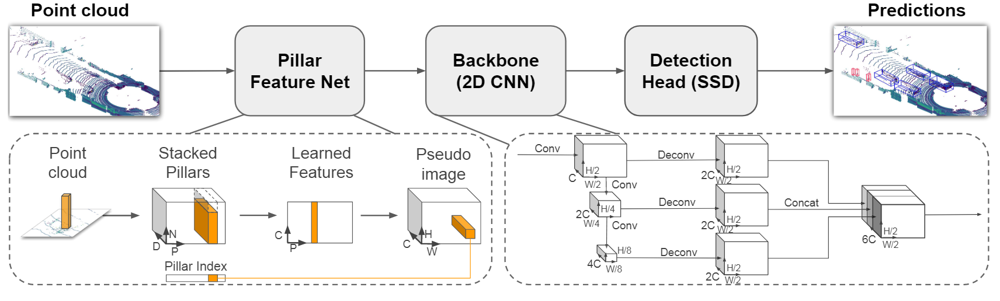

#### 2.2.2 优缺点和改进方向

| 序号 | 优点                    | 缺点                    | 改进                    |
| ---- | :----------------------------------------------------------- | :----------------------------------------------------------- | :----------------------------------------------------------- |
| 1    | **端到端学习**：将特征提取和边界框预测统一在一个端到端的可训练深度网络中，避免了手动特征工程引入和复杂的多阶段训练 | **3D信息的利用不充分**：虽然利用了点云数据的空间信息，但在某些极端情况下，可能没有充分利用垂向的3D信息 | **引入时序和注意力机制：**由于垂向方面的信息利用的不充分，在稍微牺牲处理速度的情况下，引入注意力机制和时序信息，提高模型的精度，达到精度与速度更优化的平衡 |
| 2    | **高效的特征表示**：对pillar进行编码，在处理的过程中融入PointNet的思想，并构建Pillar index，对Stacked Pillars做集中处理，使得所有计算都能基于2D卷积进行 | **缺乏对系统动态的建模**：PointPillars主要基于静态点云进行分析，缺乏对物体运动状态的建模，在动态场景下的表现可能受到限制。 | **更换检测头：**使用更为先进的检测模型，比如yolo系列         |
| 3    | **处理速度快：**达到了较快的检测速度，在KITTI数据集上，相比与VoxelNet的4.4Hz，PointPillars达到了62Hz，且保持了不错的精度 |                                                              |                                                              |
| 4    | **分类AP上升：**其分类损失函数使用了Focal loss：$L_{cls}=-\alpha_{\alpha}(1-p^{\alpha})^{\gamma}\log p^{\alpha}$ 而非以往分类中使用的binary cross entropy loss，这提高了分类准确率 |                                                              |                                                              |
| 5    | **减少垂向超参数：**与传统的固定编码器不同，PointPillars 不需要手动调整垂直方向的分箱参数，因为它直接在柱状结构（pillars）上学习特征 |                                                              |                                                              |

---

## 3 Multimodal-based Methods

:moon:基于多模态的方法列表如下：

| Order | Method          | Tag                                                          | NDS   |
| ----- | --------------- | ------------------------------------------------------------ | ----- |
| 1     | BEVFusion       | C L | 0.761 |
| 2     | IEI-BEVFusion++ | C L | 0.776 |
| 3     | BEVFusion4D     | C L T | 0.772 |
| 4     | EA-LSS          | C L | 0.776 |
| 5     | Sparse LIF      | C L T | 0.777 |
| 6     | MV2DFusion      | C L T | 0.788 |

### 3.1 BEVFusion C L

> BEVFusion: A Simple and Robust LiDAR-Camera Fusion Framework **(BEVFusion1)**

> BEVFusion: Multi-Task Multi-Sensor Fusion with Unified Bird's-Eye View Representation **(BEVFusion2)**

:star:两篇BEVFusion的处理思路大体一致，但这里主要还是以BEVFusion2为主。BEVFusion介绍了一种基于鸟瞰图的多任务多传感器融合框架，用于3D感知任务。该框架将摄像机和LiDAR特征统一到一个共享的鸟瞰图（Bird's-Eye View）表示中，以完整保留几何和语义信息。

#### 3.1.1 主要流程

> **输入：**
>
> 多视角的二维RGB图像, 激光雷达点云(三维坐标，反射率)，各传感器内外参等
>
> **输出：**(取决最后的任务头，而对于3D目标检测而言)
>
> ①概率得分图(2D)，表示每个边界框内物体类别概率
>
> ②边界框回归图，包括中心坐标、长宽高和偏航角

${\color{#E16B8C}{①}}$**获取C-BEV特征：**利用LSS的改进版(Efficient BEV Pooling with GPU kernels and GPU threads)在Camera端获取C-BEV特征;

${\color{#E16B8C}{②}}$**获取L-BEV特征：**利用VoxNet, PointPillars等模块在Lidar端获取L-BEV特征；

${\color{#E16B8C}{③}}$**BEV特征融合：**将C-BEV和L-BEV拼贴后经过BEV Encoder(基于Residual block的CNN)得到融合BEV特征；

${\color{#E16B8C}{④}}$**下游任务：**经过不同的任务头得到不同任务的结果。

#### 3.1.2 优缺点和改进方向

| 序号 | 优点                    | 缺点                    | 改进                    |
| :--- | :----------------------------------------------------------- | ------------------------------------------------------------ | ------------------------------------------------------------ |
| 1    | **高效性**：BEVFusion在相机到鸟瞰图（BEV）的转换过程中通过precomputation和interval reduction实现了40倍于LSS的加速，将延迟从超过500毫秒降低到12毫秒，仅占模型端到端运行时间的10% | **各分支不够统一：**虽然在Camera端已经显著提高了计算效率，但其Lidar端仍使用的是以往固有的模块，且在最后融合之前两个分支都没有交互，信息融合不充分 | **联合优化**：可以尝试改进Lidar端，使用类似的GPU处理策略，使之于Camera端相适应，从而进一步提高效率 |
| 2    | **信息保真**：BEVFusion采用鸟瞰图（BEV）作为统一的融合表示，这种表示对几乎所有感知任务都很友好，因为它保留了几何结构（来自LiDAR特征）和语义密度（来自相机特征） | **多视角融合不充分：**Camera端中Lift阶段是分别处理每个图像的信息，难以做到跨视角，全视域的统一处理 | **融合突出**：在BEV融合阶段，可以借助BEVFusion1提出的Dynamic Fusion Module的思想突出显著的特征 |
| 3    | **多任务支持**：BEVFusion是一个通用的多任务多传感器感知框架，支持多种3D感知任务（如3D物体检测和地图分割），并且可以轻松扩展以支持其他类型的传感器 |                                                              |                                                              |

在此附上**Efficient BEV pooling**和**Dynamic Fusion**的原理图如下：

| Efficient BEV pooling                        | Dynamic Fusion                                               |
| -------------------------------------------- | ------------------------------------------------------------ |
| 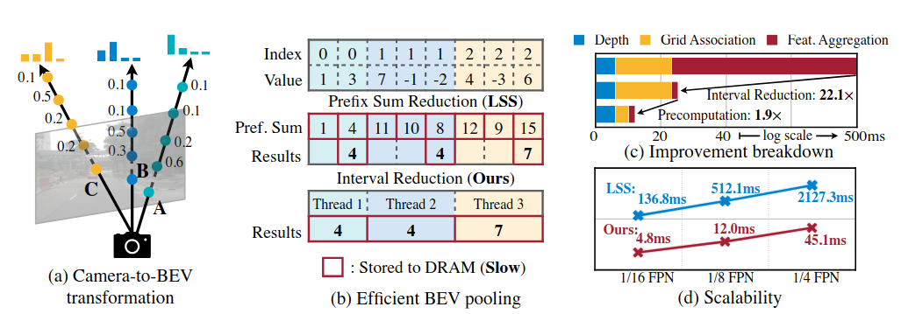 | 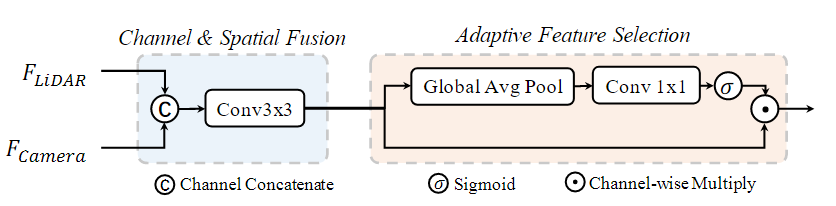 |

#### 3.1.3 源码运行

另外，由于BEVFusion过于经典，这里还尝试了配置BEVFusion环境并跑通代码(由于训练集过大和硬件支持不足，仅训练了2轮)。

| GT                                                           | PRED                                                         | CODE                                                         |
| ------------------------------------------------------------ | ------------------------------------------------------------ | ------------------------------------------------------------ |
|  |  |  |

### 3.2 IEI-BEVFusion++ C L

> [IEI-AP/IEI-BEVFusion_plus_plus (github.com)](https://github.com/IEI-AP/IEI-BEVFusion_plus_plus)

:star:这是IEI团队基于BEVFusion架构做出改进后的模型，暂时没有找到论文。IEI-BEVFusion++主要是对BEVFusion中的LiDAR端提取BEV特征、Camera端训练和分类平衡问题做了改进，从而达到了比BEFusion更高的准确率，但很遗恨没有收集到关于其检测速度的信息。

| 序号 | 改进之处                 |
| ---- | ------------------------------------------------------------ |
| 1    | LiDAR端通过融合产生于不同稀疏卷积并增加了通道数的BEV特征，以增强LiDAR端编码器的表现 |
| 2    | Camera端在训练过程中增加了一个只使用产生于Camera编码器的BEV特征进行辅助预测的分支，以发掘更多信息 |
| 3    | 采用GT-Paste算法来缓解类别不平衡的问题，且在训练过程中没有使用CBGs算法 |
| 4    | 模型允许使用多种不同尺度的体素尺寸和BEV尺寸，且在评估阶段，每种类型都采用了测试时间增强技术 |

### 3.3 BEVFusion4D C L T

> BEVFusion4D: Learning LiDAR-Camera Fusion Under Bird's-Eye-View via Cross-Modality Guidance and Temporal Aggregation

:star:本文在BEVFusion基础上引入LGVT(LiDAR-Guided View Transformer)模块，利用L-BEV辅助生成C-BEV，并在最后引入TDA(Temporal Deformable Alignment)模块融合时域信息更新当前时刻的BEV，最后加上各类任务头后输出相应的结果。

#### 3.3.1 主要流程

> **输入：**
>
> 多视角的二维RGB图像, 雷达点云(三维坐标、反射率)，各传感器内外参
>
> **输出：**(取决最后的任务头，而对于3D目标检测而言)
>
> ①概率得分图(2D)，表示每个边界框内物体类别概率
>
> ②边界框回归图，包括中心坐标、长宽高和偏航角

${\color{#E16B8C}{①}}$**特征提取：**通过backbone分别提取相机各视图的特征，并提取LiDAR的BEV特征；

${\color{#E16B8C}{②}}$**空间融合：**利用LGVT模块，将LiDAR BEV特征和上层的Camera BEV特征拼贴作为**q**，将相机多视图特征作为**k**和**v**，通过DeformAttn注意力汇聚函数得到本层的Camera BEV特征。再将最后的C-BEV和L-BEV拼贴起来；

${\color{#E16B8C}{③}}$**时间融合：**通过利用EMC(利用静态物体进行校准)校正后的t-1时刻与t时刻特征拼贴输入带有残差性质的TDA模块，更新当前时刻的BEV特征；

${\color{#E16B8C}{④}}$**下游任务：**连接不同的任务头以获取不同的任务结果。

#### 3.3.2 优缺点和改进方向

| 序号 | 优点                    | 缺点                    | 改进                    |
| :--- | :----------------------------------------------------------- | ------------------------------------------------------------ | ------------------------------------------------------------ |
| 1    | **充分发掘C-BEV：**利用LGVT指导产生C-BEV，加强了C-BEV对几何信息的表征力 | **雷达失效情景：**由于C-BEV的产生一部分依赖于L-BEV，而当L-BEV质量大幅下降时，可能会影响C-BEV的质量 | **多状态切换：**设定一定的判定机制，在L-BEV质量大幅下降时切换C-BEV的处理方法 |
| 2    | **长时间支持性：**由于融合了多帧信息，对长时间尺度的支持性提高了 | **BEV特征对齐误差：**由于EMC操作利用上下帧静态的物体进行对准，而不是利用车辆的实时imu数据，从而可能会操纵误差累计 | **使用FCN策略：**通过多尺度的特征提取，提高对小物体的检测效果 |
| 3    | **减少运动模糊：**TDA模块利用了可变形注意力机制，能够自适应地学习感受野，从而有效地捕捉移动物体在对齐的BEV特征中的显著特征。这种动态关系建模能力使得TDA能够显著减少运动模糊，提高对齐过程的准确性 | **对初始化的依赖**：LGVT的效果在一定程度上依赖于初始化的质量。如果初始化不当，可能会影响最终的对齐效果和检测性能。 | **多传感器融合：**尝试将LiDAR融入框架，加强模型对几何特征的把握能力 |
| 4    |                                                              |                                                              | **加入imu信息：**利用imu信息更加充分地对上下帧的BEV数据进行校准 |

### 3.4 EA-LSS C L

> EA-LSS: Edge-aware Lift-splat-shot Framework for 3D BEV Object Detection

:star:本文改进了LSS，提出了EA(edge-aware)-LSS结构，通过结合LiDAR信息，从而从Camera端提取更加准确的Frustum Features，结构主要包括包括：(1)EADF(edge-aware depth fusion)模块用以缓解深度突变问题；(2)FGD(fine-grained depth)模块，用以缓解预测深度图与真实深度图之间的尺寸匹配问题。

#### 3.4.1 主要流程

> **输入：**
>
> 多视角的二维RGB图像, 雷达点云(三维坐标、反射率)，各传感器内外参
>
> **输出：**
>
> Camera端的Frustum Features(经Splat后可变成C-BEV特征)

${\color{#E16B8C}{①}}$**特征提取与投影：**通过backbone分别提取相机各相机视图的特征，并投影LiDAR点云形成初始深度图$D$；

${\color{#E16B8C}{②}}$**真实深度图加工：**将$D$经过Expansion变为密集深度图$D'$，再经过梯度最大池化得到边界图$G'$,最后级联$D$和$G'$得到EADF模块的特征；

${\color{#E16B8C}{③}}$**融合提取特征：**由Camera feature直接提取Context_1 feature；将Camera feature与经反卷积EADF级联，输出Depth feature和Context_2 feature; 

${\color{#E16B8C}{④}}$**密度分布估计：**将Context_2 feature与直接由Camera feature产生的Context_1 feature逐元素相加后形成的Context feature与Depth feature做点积后形成密度分布估计，进而得到Frustum Features。

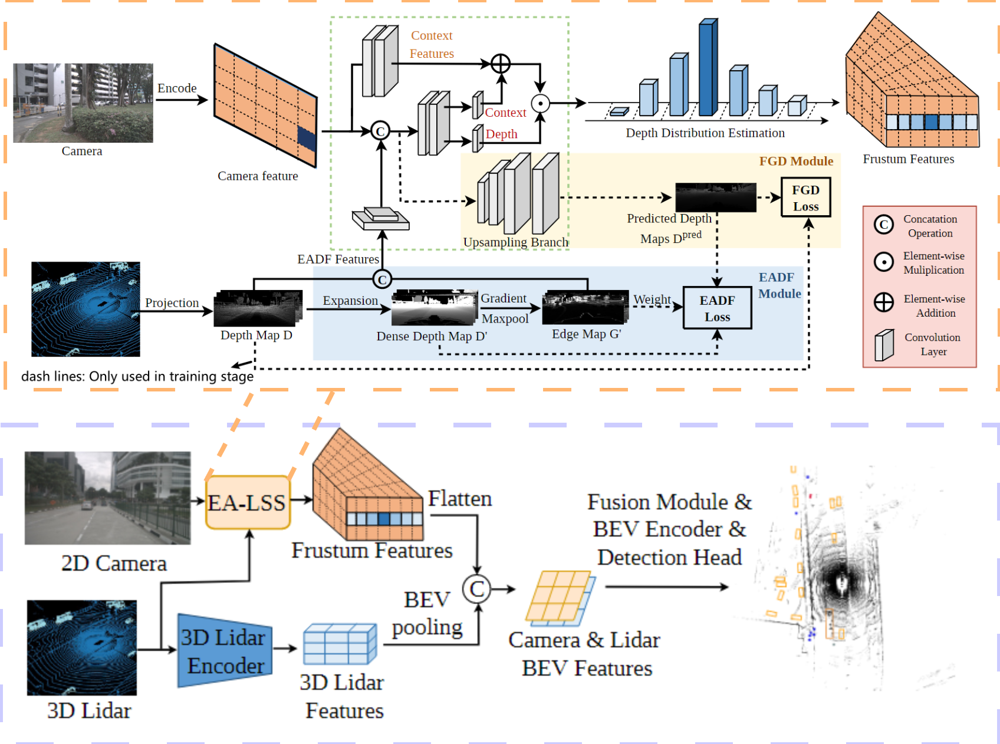

#### 3.4.2 优缺点和改进方向

| 序号 | 优点                    | 缺点                    | 改进                    |
| :--- | :----------------------------------------------------------- | ------------------------------------------------------------ | ------------------------------------------------------------ |
| 1    | **缓解深度突变问题：**引入EADF模块，结合LiDAR几何信息，有指向性低缓解了深度突变的问题 | **需要额外训练过程：**EADF模块和FGD模块部分线路是用以训练模型的，这复杂了模型的训练 | **加入注意力机制：**可以尝试加入注意力机制，实现各视图之间的沟通 |
| 2    | **缓解粒度匹配问题：**引入FGD模块，使得预测深度图的粒度与真实深度图的粒度更相符，从而进一步提高了精度 | **未充分利用跨视图信息：**这里还是对每张图片分别用EA-LSS处理，对图片之间的关联信息利用较少 | **多状态切换：**设定一定的判定机制，在点云质量大幅下降时切换为LSS处理 |
| 3    | **即插即用：**对于使用相机视图转Frustum Features之类的依赖于深度估计的方法而言，EA-LSS可以方便的嵌入，且也可以方便的配合不同的LiDAR Encoder工作 | **依赖于点云数据：**EA-LSS的训练和推理都或多或少利用了点云数据，当点云缺失或质量下降时，模型质量将受到影响 |                                                              |

### 3.5 Sparse LIF C L T

> SparseLIF: High-Performance Sparse LiDAR-Camera Fusion for 3D Object Detection

:star:本文引入了一种高性能的基于Transforemer的稀疏检测器，其性能在NuScence中名列前茅。它主要包括(1)PAQG(Perspective-Aware Query Generation)：用于具有透视投影优先级且能检测小物体的3D query；(2)RIAS(RoI-Aware Sampling)：利用query在初步特征中进行重采样；(3)UAF(Uncertainty-Aware Fusion): 基于距离不确定度，进行自适应的多模态特征融合。

#### 3.5.1 主要流程

> **输入：**
>
> 多视图相机RGB图像，雷达点云(xyzr)，传感器内外参
>
> **输出：**（取决于具体的任务头，对于3D目标检测而言）
>
> ①概率得分图，表示边界框内物体的类别概率
>
> ②边界框回归图，包括中心坐标、长宽高和偏航角

${\color{#E16B8C}{①}}$**初步特征提取：**通过backbone分别提取多尺度多时间的各相机视图特征和多尺度的点云特征；

${\color{#E16B8C}{②}}$**提取3D-query：**将图像特征输入PAQG模块，它利用单目3D和2D的联合检测器生成高质量的带透视投影优先级的3D query；

${\color{#E16B8C}{③}}$**提取RoI特征：**将3D query作为**q**，将初始特征作为**k**和**v**，输入RIAS模块进一步提取感兴趣区域的特征; 

${\color{#E16B8C}{④}}$**自适应特征融合：**将各模块的特征输入UAF模块，其利用距离不确定度来自适应的融合特征；

${\color{#E16B8C}{⑤}}$**下游任务：**连接不同的任务头以获取不同的任务结果。

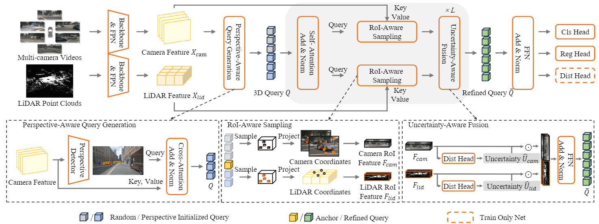

#### 3.5.2 优缺点和改进方向

| 序号 | 优点                    | 缺点                    | 改进                    |
| :--- | :----------------------------------------------------------- | ------------------------------------------------------------ | ------------------------------------------------------------ |
| 1    | **性能卓越：**曾在近期NuScence检测任务上取得第一名           | **图像质量依赖性：**虽然后期会通过UAF模块对各模态的特征进行有偏融合，但是前期各特征的生成都依赖于图像特征的指导 | **前置图像质量检测：**在利用PAQG生成query前，先对图像质量进行检查 |
| 2    | **结构统一：**整体结构呈现出对称的美感，且支持端到端的训练   | **时间融合比较隐式：**在图像特征处理端才有时间尺度的融合，缺乏显式的在最终融合特征上的时间尺度融合 | **融合雷达指导query：**可以用相似的方法生成带有几何偏向的点云query，将之与图像query融合使用 |
| 3    | **小物体检测优越：**融合了FPN操作和2D图像检测，且PAQG模块生成依赖于相机特征的带透视投影优先级的3D query，对小物体和遮挡都有较好的准确率 | **对齐缺乏：**模态之间、时域间、预测特征图尺寸与真实图尺寸之间缺乏有效对齐 | **增加对齐：**利用类似于EA-LSS中的FGD模块实现预测-真实的尺寸对齐，引入imu信息实现时域对齐 |
| 4    | **高效低延时：**RIAS模块在重投影的原始数据中选取少量稀疏关键点，重新提取，得到高度表征的稀疏特征，因而加快了运行速度 |                                                              |                                                              |
| 5    | **特殊环境鲁棒性：**通过UAF模块自适应的根据各模态的质量融合特征，提高了对特殊情况如雨雾/FOV限制的鲁棒性 |                                                              |                                                              |
| 6    | **进一步提高query质量：**通过对query channel-spatial相关系数感知混合，进一步提高了query的质量，从而提高了性能。这在之前的方法中是开创性的。 |                                                              |                                                              |

### 3.6 MV2DFusion C L T

> MV2DFusion: Leveraging Modality-Specific Object Semantics for Multi-Modal 3D Detection

:star:MV2DFusion目前在NDS指标上位列$1_{st}$。它最大的特点是对各模态分别处理，按照语义和位置划分，应用object-level法则分别获取query，而不偏向于任何一方，最后再融合进入transformer-decoder范式进行处理。它适用于各种img backbone和pcd backbone，并由于其稀疏的特性，拥有较小的计算开销和存储开销，因而满足长时段高实时的工作要求。

#### 3.6.1 主要流程

> **输入：**
>
> 多视图相机RGB图像，雷达点云(xyzr)，传感器内外参，车体实时速度与位置
>
> **输出：**（取决于具体的任务头，对于3D目标检测而言）
>
> ①概率得分图，表示边界框内物体的类别概率
>
> ②边界框回归图，包括中心坐标、长宽高和偏航角

${\color{#E16B8C}{①}}$**初步特征提取：**通过backbone分别提取多尺度多时间的各相机视图特征和多尺度的点云特征；

${\color{#E16B8C}{②}}$**应用检测器：**对图像特征和点云特征分别应用2D检测器和3D检测器获取相应的检测结果；

${\color{#E16B8C}{③}}$**获取Query：**接着把各模态的特征和检测结果分别输入对应的query生成器得到各模态的query; 

${\color{#E16B8C}{④}}$**融合解码：**将query(包括其历史)拼贴输入融合解码器(自注意力层、交叉注意力层、多尺度提取层、查询校正层)得到最后的融合特征；

${\color{#E16B8C}{⑤}}$**下游任务：**连接不同的任务头以获取不同的任务结果。

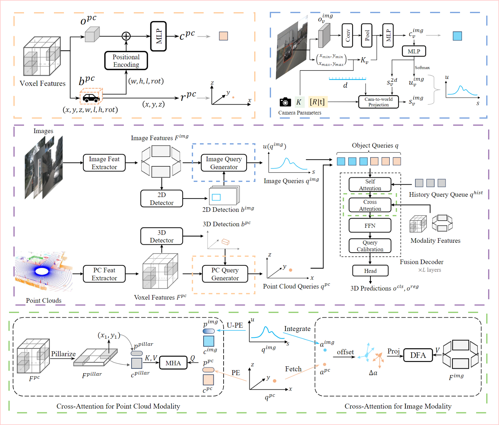

#### 3.6.2 优缺点与改进方向

| 序号 | 优点                    | 缺点                    | 改进                    |
| :--- | :----------------------------------------------------------- | ------------------------------------------------------------ | ------------------------------------------------------------ |
| 1    | **性能卓越：**目前在NuScence检测任务上取得第一名             | **缺乏前置检验**：没有对于质量较差的输入进行检验从而采取不同的措施 | **加入自适应融合：**对C-query和L-query不做简单拼贴，而是经过自适应融合(参考SparseLIF-UAF)后再输入解码器 |
| 2    | **结构统一：**整体结构呈现出对称的美感，且支持端到端的训练   | **模块细节复杂：**因为对各模态特征和各模态检测结果中的语义分量和位置分量分别处理，造成了各小模块内部的复杂处理过程 | **多状态切换：**设定一定的前置判定机制，在某些模态的数据质量大幅下降时，切换网络的结构 |
| 3    | **Query平衡性：**分别对各模块提取Query后融合进行指导，而非用单一的使用某一模态指导其他模态 |                                                              | **使用动态融合加强：**参考BEVFusion1中的Dynamic Fusion Module, 使用一个简单的点积操作来实现显著特征的加强 |
| 4    | **快速性与长时支持性：**采用足够稀疏的表示，从使得其在响应速度和长时支持性上都表现卓越 |                                                              | **加入集中操作：**参考PointPillars，建立稀疏特征的索引表，将稀疏特征汇聚成密集特征集中处理，提高计算效率 |
| 5    | **灵活性：**MV2DFusion框架可以轻易地嵌入不同的2D图像检测器/3D点云检测器/任务头 |                                                              |                                                              |
| 6    | **小物体检测优越：**应用了成熟的2D图像检测器，且使用了FPN操作，对小物体的检查能力提升 |                                                              |                                                              |
| 7    | **深度鲁棒性：**融入使用2D图像检测器而非3D图像检测器的带不确定性的图像query生成器预测深度，且在最后的decoder阶段还有二次深度的校准 |                                                              |                                                              |
| 8    | **充分利用位置/语义信息：**处理过程中将特征中的位置分量和语义分量分别进行适合其特性的处理而非笼统在一起。 |                                                              |                                                              |
| 9    | **query对齐更加准确：**使用了车辆本身的速度和位置进行query对齐而非纯识别算法的方式 |                                                              |                                                              |

## 4 Nuscenes Dataset

:moon:编写程序，对nuScences数据集的组织结构、nuscence-devkit的调用方式，尤其是对其中各个模块之间token的链接关系做了研究，为之后阅读以nuScences作为数据集的论文，编写相应程序奠定基础。

|  | 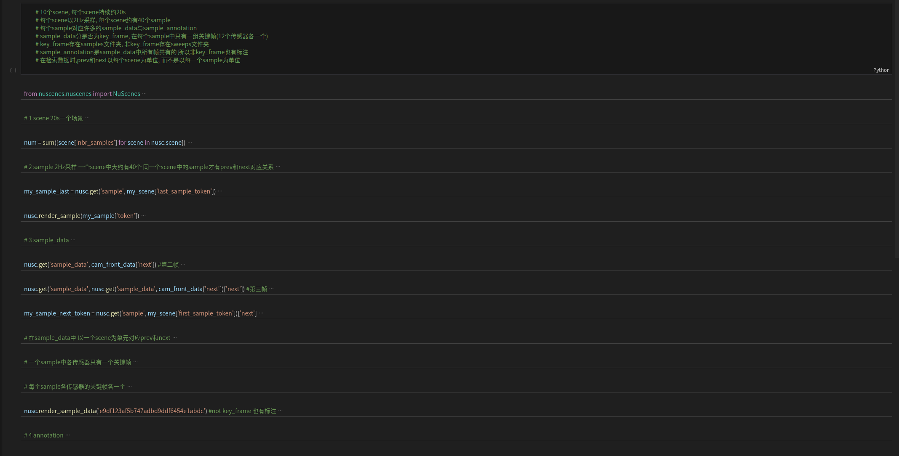 |
| ------------------------------------ | ------------------------------------ |

